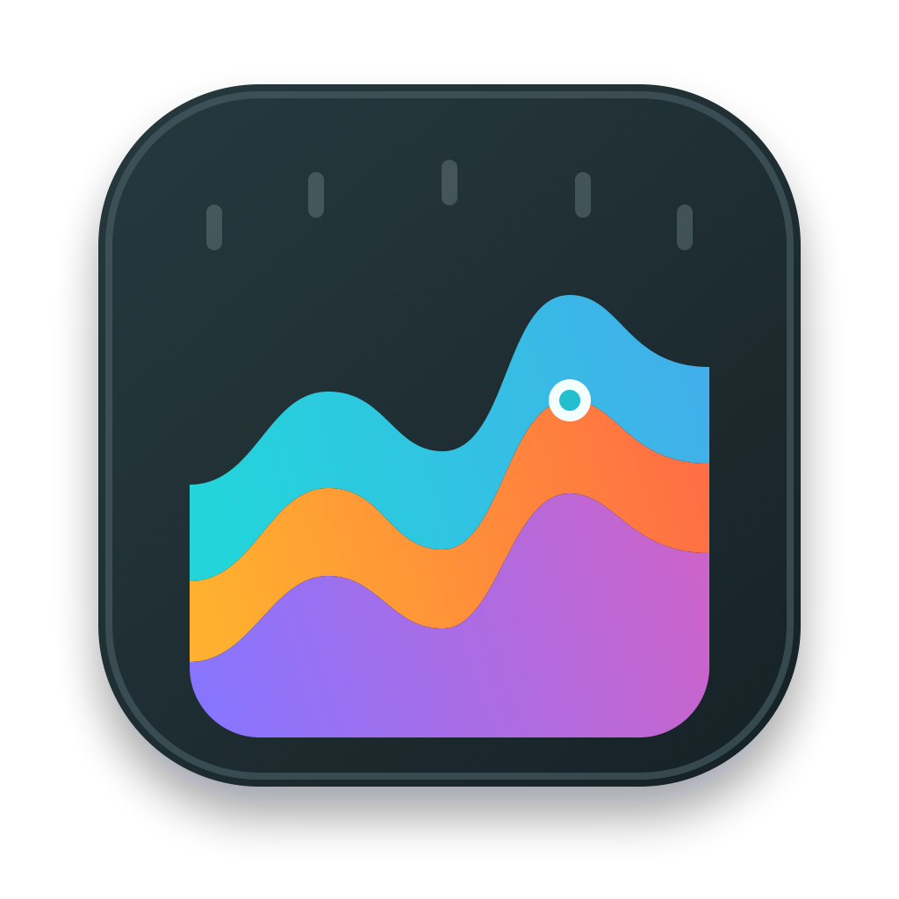

<p align="center">
  
</p>

<h1 align="center">刻度</h1>

轻量的 macOS 应用级资源监控器。监控数据默认只保存在内存中，退出应用即清除。

## 下载

从 GitHub Releases 下载 `KeduMonitor-macOS.zip`，解压后将 `刻度.app` 拖入「应用程序」。

每次推送 `main` 后，GitHub Actions 会运行测试、构建应用并发布 Release；更新说明自动汇总上次发布以来的提交。

## 开发

```bash
swift build
swift run KeduMonitor
```

生成可直接双击运行的应用：

```bash
./scripts/package-release.sh
open "dist/刻度.app"
```

要求 macOS 14 或更高版本，以及 Xcode 16 或更高版本。

## 发布签名

未配置证书时，CI 使用 ad-hoc 签名。需要稳定签名时，在仓库 Secrets 中配置：

- `KEDU_CERT_P12`：P12 文件的 Base64 内容
- `KEDU_CERT_PWD`：P12 密码
