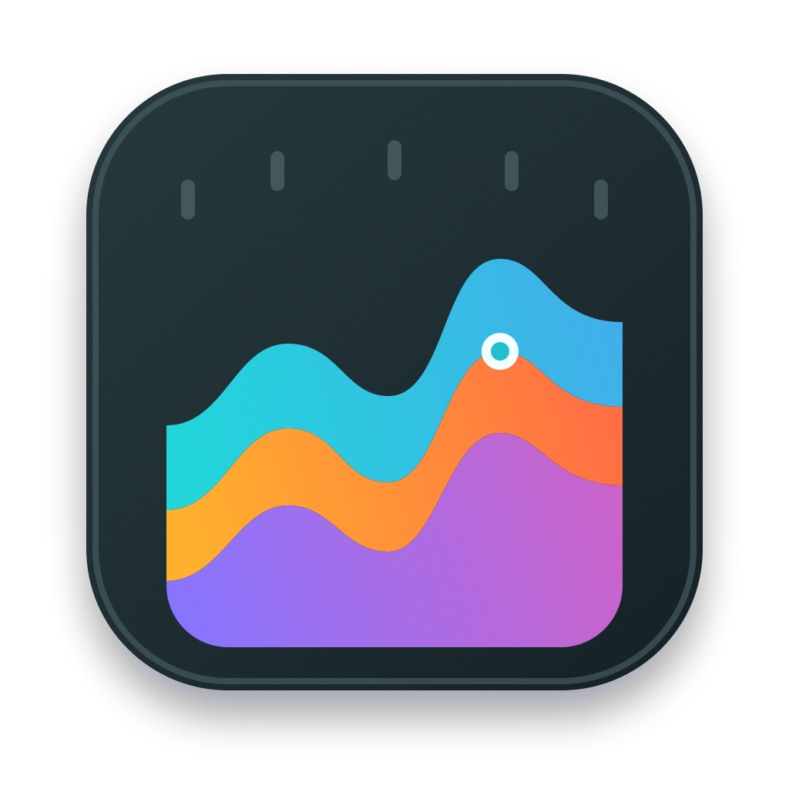

<p align="center">
  
</p>

<h1 align="center">刻度</h1>

<p align="center">轻量的 macOS 应用级资源监控器</p>

刻度在菜单栏后台采集 CPU、内存、磁盘和网络指标，按应用聚合并用堆叠面积图展示。数据默认只保存在内存中，退出应用即清除。

## 功能

- 每 5 秒采样，默认保留最近 30 分钟；间隔和保留时长可调整。
- Chrome、Electron 等多进程应用按最外层 `.app` 聚合。
- CPU 进程口径与活动监视器一致：一个逻辑核心为 `100%`。
- 磁盘展示读取/写入，网络展示下载/上传。
- 自绘堆叠面积图支持悬浮详情和点击历史时刻。
- 应用抽屉可展开到 PID，并查看启动命令、工作目录和可执行文件。
- 菜单栏浮层提供 CPU、内存、磁盘、网络近期趋势。
- 工具箱可查找持有已删除工作目录的遗留进程，并发送 `SIGTERM`。
- 会话数据可导出为 CSV。
- 无 Dock 图标；关闭主窗口后继续采集。

## 下载

从 [GitHub Releases](https://github.com/0x30/Kedu/releases) 下载 `KeduMonitor-macOS.zip`，解压后将 `刻度.app` 拖入“应用程序”。

若 macOS 阻止打开未公证构建：

```bash
xattr -cr /Applications/刻度.app
```

要求 macOS 14 或更高版本。

## 开发

要求 Xcode 26 或兼容的 Swift 6.2 工具链。

```bash
swift build
swift test
swift run KeduMonitor
```

生成可双击运行的应用和 Release ZIP：

```bash
./scripts/package-release.sh
open "dist/刻度.app"
```

## 文档

- [架构与数据口径](docs/ARCHITECTURE.md)
- [开发与发布](docs/DEVELOPMENT.md)
- [当前项目状态](docs/STATUS.md)
- [AI 开发指南](AGENTS.md)
